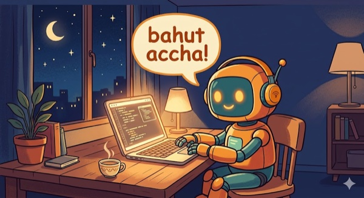

# claude-code-sahib

> A collection of voice characters for Claude Code. Bahut accha, sir.

<p align="center"></p>

<p align="center">
  <a href="https://youtu.be/fn8WFHgQC0E">
    
  </a>
  <br>
  <sub><a href="https://youtu.be/fn8WFHgQC0E">▶ Watch the demo</a></sub>
</p>

---

**A note on tone.** This project started as an affectionate parody of Indian-English corporate politeness (the Sahib character) and has grown into an umbrella for character voices — aristocratic butler, Russian street kid, burnt-out developer. Some characters contain profanity and harsh humor; that's the aesthetic of those specific archetypes, not the project's overall register. If a character crosses a line for you, open an issue. Any character with strong language is flagged with a `content_warning` and the installer asks before proceeding.

---

## Characters

| ID | Name | Languages | Vibe | Content warning |
|---|---|---|---|---|
| `sahib` | Sahib | en | Warm, formal, "doing the needful" Indian-English assistant | — |
| `butler` | Butler / Дворецкий | en, ru | Refined, understated Jeeves energy | — |
| `gopnik` | Гопник | ru | Russian street-kid archetype, "по понятиям" | ✓ profanity |
| `govnokoder` | Говнокодер | ru | Cynical burnt-out developer, dark engineering humor | ✓ profanity |

## Quick start

**Install a character** (macOS / Linux, requires `jq` — `brew install jq`):

```bash
git clone https://github.com/dalamber/claude-code-sahib
cd claude-code-sahib
bash setup.sh                                            # interactive: pick character + language
bash setup.sh --character butler --language en           # non-interactive
bash setup.sh --character gopnik --language ru           # prompts on content warning
bash setup.sh --uninstall
```

**Windows** (PowerShell):

```powershell
git clone https://github.com/dalamber/claude-code-sahib
cd claude-code-sahib
powershell -ExecutionPolicy Bypass -File setup.ps1                                  # interactive
powershell -ExecutionPolicy Bypass -File setup.ps1 -Character butler -Language en   # non-interactive
powershell -ExecutionPolicy Bypass -File setup.ps1 -Uninstall
```

`setup.sh` / `setup.ps1` copies the character's MP3s into `~/.claude/sounds/active/`, merges `spinnerVerbs` into `~/.claude/settings.json` (with a timestamped backup), wires Claude Code hooks to `play.sh` / `play.ps1`, and installs a `sahib` shell alias + `/sahib` slash command. To switch characters, just run `setup.sh` again with different args — the sound folder is wiped and rewritten.

**Generate your own audio**

Free, no account (Edge TTS):

```bash
pip install edge-tts
python scripts/generate_edge_tts.py --character butler --language en
```

ElevenLabs (requires a Starter+ subscription — edit `characters/<id>/character.json` with a real `voice_id` first):

```bash
pip install requests
export ELEVENLABS_API_KEY=your_key_here
python scripts/generate_elevenlabs.py --character butler --language en
```

Both scripts write to `characters/<id>/<lang>/sounds/<category>/<category>_NN.mp3` and are idempotent; use `--force` to regenerate, `--category done` to target one category.

## Toggling the voice

```bash
sahib        # toggle
sahib off    # silence
sahib on     # back on
```

Works across all characters — the flag file lives at `~/.claude/sounds/active/.disabled`.

## Adding phrases, languages, or new characters

See [CONTRIBUTING.md](CONTRIBUTING.md). TL;DR: fork, drop a folder under `characters/`, keep the tone affectionate, open a PR.

## Voice credits

| Character | Language | Voice |
|---|---|---|
| sahib | en | ElevenLabs — [Aditya Rao, "Motivated, Clear and Smooth"](https://elevenlabs.io/app/voice-library?voiceId=HAbWfLBk6HVxg0scLcvE) |
| butler | en | ElevenLabs — [voice `fjnwTZkKtQOJaYzGLa6n`](https://elevenlabs.io/app/voice-library?voiceId=fjnwTZkKtQOJaYzGLa6n) |
| butler | ru | ElevenLabs — [voice `6sFKzaJr574YWVu4UuJF`](https://elevenlabs.io/app/voice-library?voiceId=6sFKzaJr574YWVu4UuJF) |
| gopnik | ru | ElevenLabs — [voice `qxjGnozOAtD4eqNuXms4`](https://elevenlabs.io/app/voice-library?voiceId=qxjGnozOAtD4eqNuXms4) |
| govnokoder | ru | ElevenLabs — [voice `NYC9WEgkq1u4jiqBseQ9`](https://elevenlabs.io/app/voice-library?voiceId=NYC9WEgkq1u4jiqBseQ9) |

Edge TTS fallback voices: `en-IN-PrabhatNeural`, `ru-RU-DmitryNeural`.

## License

MIT — see [LICENSE](LICENSE).
